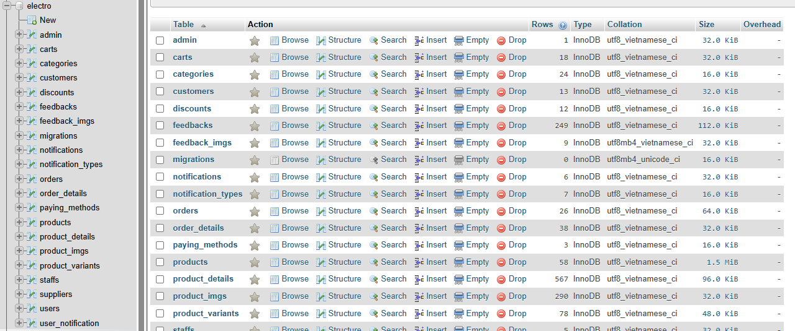
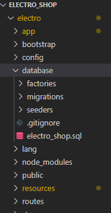

# ElectroShop - Website Bán Đồ Điện Tử

##  Mô tả dự án
ElectroShop là website thương mại điện tử chuyên bán các sản phẩm điện tử như máy lạnh, máy giặt, tivi, điện thoại, laptop, tablet, tủ lạnh, nồi cơm điện, nồi chiên không khí và bếp điện.
##  Công nghệ sử dụng
- **Backend**: Laravel 10.x
- **Frontend**: Blade Template Engine + Tailwind CSS
- **JavaScript**: Alpine.js cho tương tác
- **Icons**: Font Awesome 6.4.0
- **Fonts**: Inter/Roboto

## Cấu trúc File đã tạo

```
resources/
├── css/
│   └── app.css                          # Tailwind CSS config với custom classes
├── views/
│   ├── layouts/
│   │   └── app.blade.php                # Layout chính với Header, Footer
│   ├── home.blade.php                   # Trang chủ
│   ├── products/
│   │   ├── index.blade.php              # Danh sách sản phẩm với filters
│   │   └── show.blade.php               # Chi tiết sản phẩm
│   ├── cart/
│   │   └── index.blade.php              # Giỏ hàng
│   ├── checkout/
│   │   └── index.blade.php              # Thanh toán
│   └── account/
│       └── profile.blade.php            # Tài khoản người dùng
tailwind.config.js                       # Cấu hình Tailwind
```

##  Hướng dẫn cài đặt

### 1. Cài đặt Tailwind CSS
### tạo database đặt tên là electro


và import file .sql vào nó nằm trong thư mục databsae 
sau đó tạo file .env và copy file .env.example vào file .env sau đó đổi đoạn kết nối lại như dưới
DB_CONNECTION=mysql
DB_HOST=127.0.0.1
DB_PORT=3306
DB_DATABASE=electro
DB_USERNAME=root
DB_PASSWORD=
```bash
# Cài đặt Tailwind CSS và dependencies
npm install -D tailwindcss postcss autoprefixer

# Hoặc nếu chưa có package.json
npm init -y
npm install -D tailwindcss postcss autoprefixer
```

### 3. Cài đặt các dependencies

```bash
# Cài đặt node modules
npm install

# Build assets
npm run dev

# Hoặc build cho production
npm run build
```

### 5. Chạy ứng dụng

```bash
# Terminal 1: Chạy Vite (để compile CSS/JS)
npm run dev

# Terminal 2: Chạy Laravel server
php artisan serve
```

Truy cập: `http://localhost:8000`

##  Tính năng giao diện

###  Đã hoàn thành:

1. **Layout chính (app.blade.php)**
   - Header với logo, search bar, giỏ hàng, tài khoản
   - Top bar với hotline và email
   - Navigation menu responsive với mega menu
   - Footer đầy đủ thông tin
   - Back to top button
   - Mobile responsive

2. **Trang chủ (home.blade.php)**
   - Banner slider với 3 slides
   - Grid danh mục sản phẩm (10 categories)
   - Flash Sale section
   - Sản phẩm bán chạy
   - Sản phẩm mới nhất
   - Brand partners
   - Newsletter signup

3. **Danh sách sản phẩm (products/index.blade.php)**
   - Sidebar filters (danh mục, giá, thương hiệu, rating)
   - Grid sản phẩm responsive
   - Sort options
   - Pagination
   - Active filters display

4. **Chi tiết sản phẩm (products/show.blade.php)**
   - Image slider với thumbnails
   - Product variants (dung lượng, màu sắc)
   - Quantity selector
   - Product tabs (mô tả, thông số, đánh giá)
   - Reviews với hình ảnh
   - Related products

5. **Giỏ hàng (cart/index.blade.php)**
   - Danh sách sản phẩm trong giỏ
   - Quantity controls
   - Remove items
   - Voucher section
   - Order summary
   - Empty cart state

6. **Thanh toán (checkout/index.blade.php)**
   - Progress steps
   - Customer information form
   - Shipping address form
   - Shipping methods
   - Payment methods (COD, Bank, Card, MoMo, Installment)
   - Order summary sidebar

7. **Tài khoản (account/profile.blade.php)**
   - Sidebar navigation
   - Profile information form
   - Order history với tabs
   - Order status tracking


